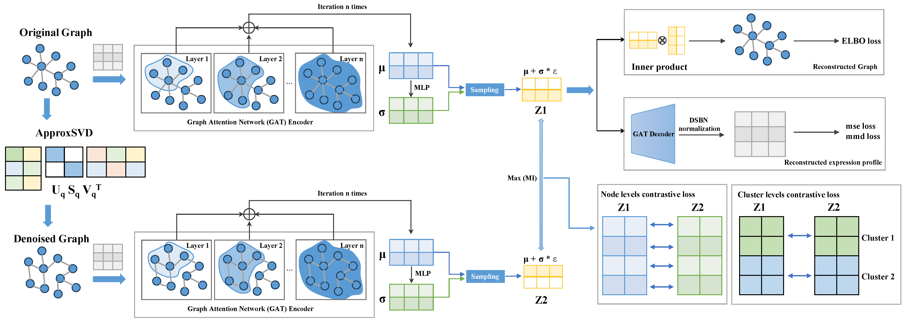

# Garfield: G**raph-based Contrastive Le**ar**ning enable **F**ast S**i**ngle-C**el**l Embe**dding


## Installation
Please install `Garfield` from pypi with:
```bash
pip install Garfield
```

install from Github:

```
pip install git+https://github.com/zhou-1314/Garfield.git
```

or git clone and install:

```
git clone https://github.com/zhou-1314/Garfield.git
cd Garfield
python setup.py install
```

Garfield is implemented in [Pytorch](https://pytorch.org/) framework.

## Usage

```python
## load packages
import os
import Garfield as gf
import scanpy as sc
gf.__version__

# set workdir
workdir = 'garfield_multiome_10xbrain'
gf.settings.set_workdir(workdir)

### modify parameter
user_config = dict(
    ## Input options
    adata_list=mdata,  
    profile='multi-modal', 
    data_type='Paired',
    sub_data_type=['rna', 'atac'],
    sample_col=None, 
    weight=0.5,
    ## Preprocessing options
    graph_const_method='mu_std',
    genome='hg38',
    use_gene_weight=True,
    use_top_pcs=False,
    used_hvg=True,
    min_cells=3,
    min_features=0,
    keep_mt=False,
    target_sum=1e4,
    rna_n_top_features=3000,
    atac_n_top_features=100000,
    n_components=50,
    n_neighbors=5,
    metric='euclidean', 
    svd_solver='arpack',
    # datasets
    adj_key='connectivities',
    # data split parameters
    edge_val_ratio=0.1,
    edge_test_ratio=0.,
    node_val_ratio=0.1,
    node_test_ratio=0.,
    ## Model options
    augment_type='svd',
    svd_q=5,
    use_FCencoder=False,
    conv_type='GATv2Conv', # GAT or GATv2Conv or GCN
    gnn_layer=2,
    hidden_dims=[128, 128],
    bottle_neck_neurons=20,
    cluster_num=20,
    drop_feature_rate=0.2, 
    drop_edge_rate=0.2,
    num_heads=3,
    dropout=0.2,
    concat=True,
    used_edge_weight=False,
    used_DSBN=False,
    used_mmd=False,
    # data loader parameters
    num_neighbors=5,
    loaders_n_hops=2,
    edge_batch_size=4096,
    node_batch_size=128, # None
    # loss parameters
    include_edge_recon_loss=True,
    include_gene_expr_recon_loss=True,
    lambda_latent_contrastive_loss=1.0,
    lambda_gene_expr_recon=300.,
    lambda_edge_recon=500000.,
    lambda_omics_recon_mmd_loss=0.2,
    # train parameters
    n_epochs_no_edge_recon=0,
    learning_rate=0.001,
    weight_decay=1e-05,
    gradient_clipping=5,
    # other parameters
    latent_key='garfield_latent',
    reload_best_model=True,
    use_early_stopping=True,
    early_stopping_kwargs=None,
    monitor=True,
    seed=2024,
    verbose=True
)
dict_config = gf.settings.set_gf_params(user_config)

from Garfield.model import Garfield

# Initialize model
model = Garfield(dict_config)
# Train model
model.train()
# Compute latent neighbor graph
latent_key = 'garfield_latent'
sc.pp.neighbors(model.adata,
                use_rep=latent_key,
                key_added=latent_key)
# Compute UMAP embedding
sc.tl.umap(model.adata,
           neighbors_key=latent_key)
sc.pl.umap(model.adata, color=[ 'celltype'], show=True, size=3) 

model_folder_path = "./slideseqv2_mouse_hippocampus/model"
os.makedirs(figure_folder_path, exist_ok=True)
# Save trained model
model.save(dir_path=model_folder_path,
           overwrite=True,
           save_adata=True,
           adata_file_name="adata.h5ad")
```
### Main Parameters of Garfield Model

#### Data Preprocessing Parameters

- **adata_list**: List of AnnData objects containing data from multiple batches or samples.
- **profile**: Specifies the data profile type (e.g., 'RNA', 'ATAC', 'ADT', 'multi-modal', 'spatial').
- **data_type**: Type of the multi-omics dataset (e.g., Paired, UnPaired) for preprocessing.
- **sub_data_type**: List of data types for multi-modal datasets (e.g., ['rna', 'atac'] or ['rna', 'adt']).
- **sample_col**: Column in the dataset that indicates batch or sample identifiers.
- **weight**: Weighting factor that determines the contribution of different modalities or types of graphs in multi-omics or spatial data.
  - For non-spatial single-cell multi-omics data (e.g., RNA + ATAC),
    `weight` specifies the contribution of the graph constructed from scRNA data.
    The remaining (1 - weight) represents the contribution from the other modality.
  - For spatial single-modality data,
    `weight` refers to the contribution of the graph constructed from the physical spatial information,
    while (1 - weight) reflects the contribution from the molecular graph (RNA graph).
- **graph_const_method**: Method for constructing the graph (e.g., 'mu_std', 'Radius', 'KNN', 'Squidpy').
- **genome**: Reference genome to use during preprocessing.
- **use_gene_weight**: Whether to apply gene weights in the preprocessing step.
- **use_top_pcs**: Whether to use the top principal components during dimensionality reduction.
- **used_hvg**: Whether to use highly variable genes (HVGs) for analysis.
- **min_features**: Minimum number of features required for a cell to be included in the dataset.
- **min_cells**: Minimum number of cells required for a feature to be retained in the dataset.
- **keep_mt**: Whether to retain mitochondrial genes in the analysis.
- **target_sum**: Target sum used for normalization (e.g., 1e4 for counts per cell).
- **rna_n_top_features**: Number of top features to retain for RNA datasets.
- **atac_n_top_features**: Number of top features to retain for ATAC datasets.
- **n_components**: Number of components to use for dimensionality reduction (e.g., PCA).
- **n_neighbors**: Number of neighbors to use in graph-based algorithms.
- **metric**: Distance metric used during graph construction.
- **svd_solver**: Solver for singular value decomposition (SVD).
- **adj_key**: Key in the AnnData object that holds the adjacency matrix.

#### Data Split Parameters

- **edge_val_ratio**: Ratio of edges to use for validation in edge-level tasks.
- **edge_test_ratio**: Ratio of edges to use for testing in edge-level tasks.
- **node_val_ratio**: Ratio of nodes to use for validation in node-level tasks.
- **node_test_ratio**: Ratio of nodes to use for testing in node-level tasks.

#### Model Architecture Parameters

- **augment_type**: Type of augmentation to use (e.g., 'dropout', 'svd').
- **svd_q**: Rank for the low-rank SVD approximation.
- **use_FCencoder**: Whether to use a fully connected encoder before the graph layers.
- **hidden_dims**: List of hidden layer dimensions for the encoder.
- **bottle_neck_neurons**: Number of neurons in the bottleneck (latent) layer.
- **num_heads**: Number of attention heads for each graph attention layer.
- **dropout**: Dropout rate applied during training.
- **concat**: Whether to concatenate attention heads or not.
- **drop_feature_rate**: Dropout rate applied to node features.
- **drop_edge_rate**: Dropout rate applied to edges during augmentation.
- **used_edge_weight**: Whether to use edge weights in the graph layers.
- **used_DSBN**: Whether to use domain-specific batch normalization.
- **conv_type**: Type of graph convolution to use ('GAT', 'GCN').
- **gnn_layer**: Number of times the graph neural network (GNN) encoder is repeated in the forward pass.
- **cluster_num**: Number of clusters for latent feature clustering.

#### Data Loader Parameters

- **num_neighbors**: Number of neighbors to sample for graph-based data loaders.
- **loaders_n_hops**: Number of hops for neighbors during graph construction.
- **edge_batch_size**: Batch size for edge-level tasks.
- **node_batch_size**: Batch size for node-level tasks.

#### Loss Function Parameters

- **include_edge_recon_loss**: Whether to include edge reconstruction loss in the training objective.
- **include_gene_expr_recon_loss**: Whether to include gene expression reconstruction loss in the training objective.
- **used_mmd**: Whether to use maximum mean discrepancy (MMD) for domain adaptation.
- **lambda_latent_contrastive_instanceloss**: Weight for the instance-level contrastive loss.
- **lambda_latent_contrastive_clusterloss**: Weight for the cluster-level contrastive loss.
- **lambda_gene_expr_recon**: Weight for the gene expression reconstruction loss.
- **lambda_edge_recon**: Weight for the edge reconstruction loss.
- **lambda_omics_recon_mmd_loss**: Weight for the MMD loss in omics reconstruction tasks.

#### Training Parameters

- **n_epochs**: Number of training epochs.
- **n_epochs_no_edge_recon**: Number of epochs without edge reconstruction loss.
- **learning_rate**: Learning rate for the optimizer.
- **weight_decay**: Weight decay (L2 regularization) for the optimizer.
- **gradient_clipping**: Maximum norm for gradient clipping.

#### Other Parameters

- **latent_key**: Key for storing latent features in the AnnData object.

- **reload_best_model**: Whether to reload the best model after training.

- **use_early_stopping**: Whether to use early stopping during training.

- **early_stopping_kwargs**: Arguments for configuring early stopping (e.g., patience, delta).

- **monitor**: Whether to print training progress.

- **seed**: Random seed for reproducibility.

- **verbose**: Whether to display detailed logs during training.

## Support

Please submit issues or reach out to zhouwg1314@gmail.com.

## Acknowledgment
Garfield uses and/or references the following libraries and packages:

- [NicheCompass](https://github.com/Lotfollahi-lab/nichecompass)

- [scArches](https://github.com/theislab/scarches)

- [SIMBA](https://github.com/pinellolab/simba)
- [MaxFuse](https://github.com/shuxiaoc/maxfuse)
- [scanpy](https://github.com/scverse/scanpy)

Thanks for all their contributors and maintainers!

## Citation
If you have used Garfiled for your work, please consider citing:
```bibtex
@misc{2024Garfield,
    title={Garfield: Graph-based Contrastive Learning enable Fast Single-Cell Embedding},
    author={Weige Zhou},
    howpublished = {\url{https://github.com/zhou-1314/Garfield}},
    year={2024}
}
```

