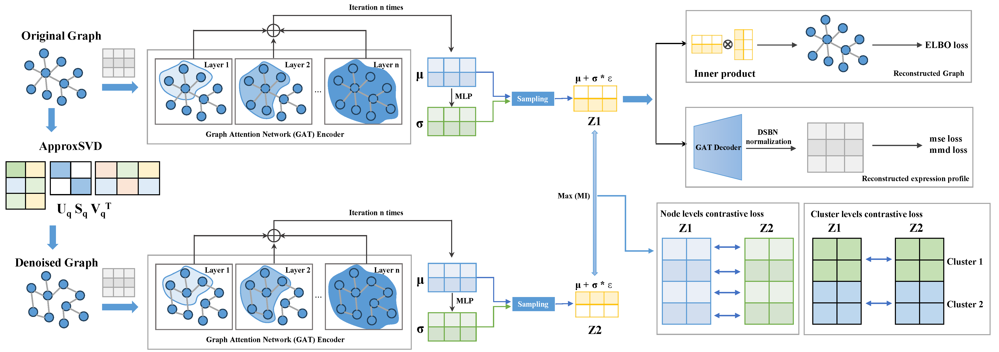

# Garfield: G**raph-based Contrastive Le**ar**ning enable **F**ast S**i**ngle-C**el**l Embe**dding


## Repository layout
```
├── Garfield
│   ├── data
│   │   └── gene_anno
│   │       ├── hg19_genes.bed
│   │       ├── hg38_genes.bed
│   │       ├── mm10_genes.bed
│   │       └── mm9_genes.bed
│   ├── __init__.py
│   ├── model
│   │   ├── Garfield_net.py
│   │   ├── GarfieldTrainer.py
│   │   ├── __init__.py
│   │   ├── _layers.py
│   │   ├── _loss.py
│   │   ├── metrics.py
│   │   ├── prepare_Data.py
│   │   ├── _tools.py
│   │   └── _utils.py
│   ├── preprocessing
│   │   ├── _graph.py
│   │   ├── __init__.py
│   │   ├── _pca.py
│   │   ├── preprocess.py
│   │   ├── _qc.py
│   │   ├── read_adata.py
│   │   └── _utils.py
│   ├── _settings.py
│   └── _version.py
├── imgs
│   └── Garfield_framework.png
├── LICENSE
├── README.md
├── requirements.txt
└── setup.py
```

## Installation
Please install `Garfield` from pypi with:
```bash
pip install Garfield
```

install from Github:

```
pip install git+https://github.com/zhou-1314/Garfield.git
```

or git clone and install:

```
git clone https://github.com/zhou-1314/Garfield.git
cd Garfield
python setup.py install
```

Garfield is implemented in [Pytorch](https://pytorch.org/) framework.

## Usage

```python
## load packages
import os
import Garfield as gf
import scanpy as sc
gf.__version__

## set the working directory
workdir = 'result_garfield_test'
gf.settings.set_workdir(workdir)

gf.settings.set_figure_params(dpi=80,
                              style='white',
                              fig_size=[5,5],
                              rc={'image.cmap': 'viridis'})
## make plots prettier
from matplotlib_inline.backend_inline import set_matplotlib_formats
set_matplotlib_formats('retina')

## Set the parameters for Garfield training
dict_config = dict(
    ## Input options
    data_dir=workdir,  
    project_name='test',  
    adata_list='./example_data/rna_muraro2016.h5ad',  
    profile='RNA',
    data_type=None,  # Paired
    sample_col=None,  

    ## Dataset preprocessing options
    filter_cells_rna=False,  
    min_features=100,
    min_cells=3,
    keep_mt=False,
    normalize=True, 
    target_sum=1e4,
    used_hvg=True,  
    used_scale=True,
    single_n_top_genes=2000,  
    rna_n_top_features=2000, 
    atac_n_top_features=30000,
    metacell=False,  
    metacell_size=1,  
    n_pcs=20,
    n_neighbors=15,  
    svd_solver='arpack',
    method='umap',
    metric='euclidean',  
    resolution_tol=0.1,  
    leiden_runs=1,  
    leiden_seed=None,  
    verbose=True,  

    ## Model options
    gnn_layer=2,
    conv_type='GAT',
    hidden_dims=[128, 128],
    bottle_neck_neurons=20,
    svd_q=5,  # default=5, type=int, help='rank'
    cluster_num=20,
    num_heads=3,
    concat=True,
    used_edge_weight=True,
    used_recon_exp=True,
    used_DSBN=False,
    used_mmd=False,
    patience=5,
    test_split=0.1,
    val_split=0.1,
    batch_size=128,  # INT   batch size of model training
    num_neighbors=[3, 3],
    epochs=50,  # INT       Number of epochs.                        Default is 100.
    dropout=0.2,  # FLOAT     Dropout rate.                            Default is 0.
    mmd_temperature=0.2,  ## mmd regu
    instance_temperature=1.0,
    cluster_temperature=0.5,
    l2_reg=1e-03,
    gradient_clipping=5,  #
    learning_rate=0.001,  # FLOAT     Learning rate.     
    weight_decay=1e-05,  # FLOAT     Weight decay.    

    ## Other options
    monitor_only_val_losses=False,
    outdir=None,  # String      Save the model.
    load=False,  # Bool      Load the model.
)

## start training
from Garfield.model import GarfieldTrainer
trainer = GarfieldTrainer(dict_config)
trainer.fit()

## visualize embeddings of cells
adata_final = trainer.get_latent_representation()
sc.tl.umap(adata_final)
sc.pl.umap(adata_final, color=['cell_type1'], wspace=0.15, edges=False)
```
## Support
Please submit issues or reach out to zhouwg1314@gmail.com.

## Acknowledgment
ccVAE uses and/or references the following libraries and packages:

- [SIMBA](https://github.com/pinellolab/simba)
- [scanpy](https://github.com/scverse/scanpy)

Thanks for all their contributors and maintainers!

## Citation
If you have used Garfiled for your work, please consider citing:
```bibtex
@misc{2024Garfield,
    title={Garfield: Graph-based Contrastive Learning enable Fast Single-Cell Embedding},
    author={Weige Zhou},
    howpublished = {\url{https://github.com/zhou-1314/Garfield}},
    year={2024}
}
```

