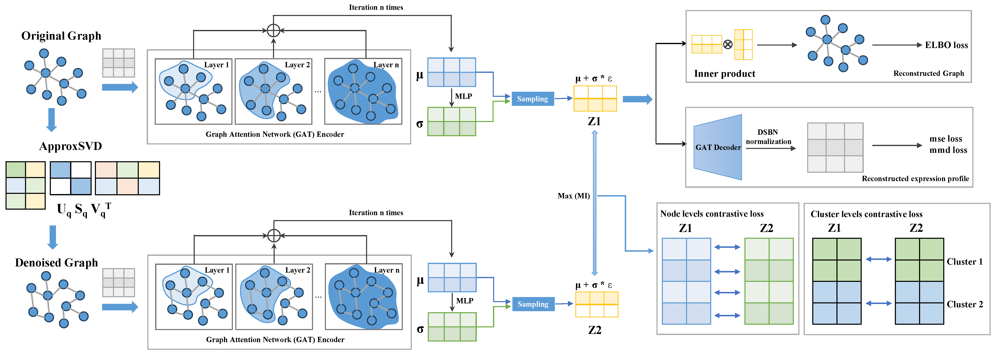

|Docs| |Pypi| |Downloads| |Code style| |pre-commit| |License|

Garfield: Graph-based Contrastive Learning enables Fast Single-Cell Embedding
=============================================================================

Garfield is a novel graph representation algorithm with contrastive learning to embed cells into the same latent space. The joint embedding of cells allows Garfield to perform various types of single cell or spatial tasks, including scRNA-seq, scATAC-seq and scProtein clustering, batch correction, multi-omics integration, spatial domain discovery and label transfer of spatial data with scRNA-seq data.

.. toctree::
   :maxdepth: 2
   :caption: Overview
   :hidden:

   About Garfield
   Installation
   API
   Release notes
   Citation

.. toctree::
   :maxdepth: 1
   :caption: Tutorials

   tutorial/01.panc8_all_batch_correction
   tutorial/02.panc_mapping
   tutorial/03.10x_pbmc_paired_scMulti_analysis
   tutorial/04.Garfield_spatia_molecular_niche_seqFISH_Mouse_Organogenesis
   tutorial/05.Garfield_spatial_niche_slideseqv2_mouse_hippocampus
   tutorial/06.Garfield_spMulti_mouse_brain

.. |Docs| image:: https://readthedocs.org/projects/garfield-bio/badge/?version=latest
   :target: https://garfield-bio.readthedocs.io

.. |Pypi| image:: https://img.shields.io/pypi/v/garfield
   :target: https://pypi.org/project/garfield

.. |Downloads| image:: https://static.pepy.tech/badge/Garfield/month
   :target: https://pepy.tech/project/Garfield

.. |Code style| image:: https://img.shields.io/badge/code%20style-black-000000.svg
   :target: https://github.com/psf/black

.. |pre-commit| image:: https://img.shields.io/badge/pre--commit-enabled-brightgreen?logo=pre-commit&logoColor=white
   :target: https://github.com/pre-commit/pre-commit

.. |License| image:: https://img.shields.io/badge/License-BSD_3--Clause-blue.svg
   :target: https://github.com/zhou-1314/Garfield/blob/main/LICENSE

