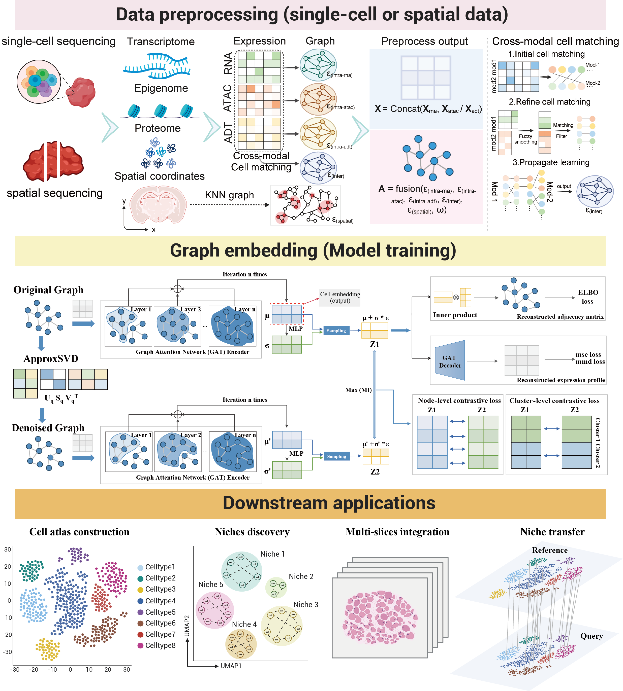

Garfield: **G**raph-based Contrastive Le**ar**ning enables **F**ast S**i**ngle-C**el**l Embe**d**ding
========================================================================

Garfield is a novel graph representation algorithm with contrastive learning to embed cells into the same latent space. The joint embedding of cells allows Garfield to perform various types of single cell or spatial tasks, including scRNA-seq, scATAC-seq and scProtein clustering, batch correction, multi-omics integration, spatial domain discovery and label transfer of spatial data with scRNA-seq data.

.. toctree::
   :maxdepth: 2
   :caption: Overview
   :hidden:

   About Garfield
   Installation
   API
   Release notes
   Citation

.. toctree::
   :maxdepth: 1
   :caption: Tutorials

   rna_10xpmbc_all_genes
   atac_buenrostro2018_peaks_and_sequences
   multiome_shareseq
   multiome_shareseq_GRN
   rna_mouse_atlas
   rna_human_pancreas
   multiome_10xpmbc10k_integration
   rna_10x_mouse_brain_1p3M

